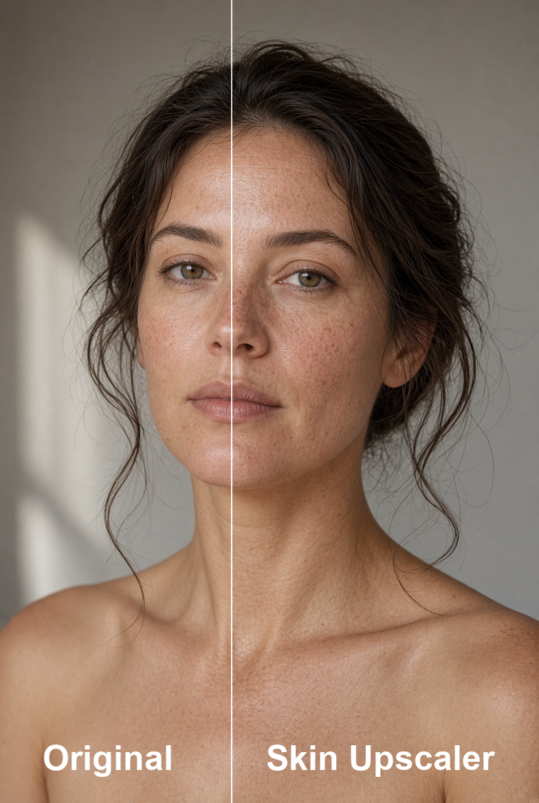

# ComfyUI LC123 Nodes

Custom nodes for [ComfyUI](https://github.com/comfyanonymous/ComfyUI) by [lonecatone23](https://github.com/lonecatone23).

- **Repo:** [https://github.com/lonecatone23/ComfyUI_LC123_nodes](https://github.com/lonecatone23/ComfyUI_LC123_nodes)
- **Civitai:** [lonecatone23](https://civitai.com/user/lonecatone23)
- **Instagram:** [synth.studio.models](https://www.instagram.com/synth.studio.models/)
- **Support:** [Buy me a ☕](https://ko-fi.com/lonecatone)
- **Version:** 1.31.1 · **112 Python nodes** · **4 JS-only** (LC Bypasser, LC Mute, Groups Bypasser, Panel)

> Small tools that remove friction: less wire mess, fewer clicks, clearer workflows.

For **Anima regional attention**, also grab [Sen-sou Anima Regional Conditioning](https://github.com/Sen-sou/Comfyui-Anima-Regional-Conditioning).

Release history lives in **git tags**. This page describes the pack **as it is right now**, not a changelog.

---

## LC Lighting Control 🔦

Relight an image after the fact. Feed it a **normal map** + **depth map** (and optionally a subject mask), and it repaints the light and shadow on the same pixels. No re-generation needed.


| Input | Role |
|--------|------|
| **image** | Photo / render to relight |
| **normal_map** | Surface facing (BAE / DSINE recommended) |
| **depth_map** | Near vs far (Depth Anything V2 recommended; invert if bright = near and lighting looks inside-out) |
| **mask** (optional) | Subject matte. Used only when **mask_enabled**. High blend can fringe: ~0.2–0.45 or leave off |

**The math, plainly:** every pixel gets multiplied by how much light actually hits it. Facing the key light = brighter. Turned away or blocked by depth = darker. Ambient is the floor so shadows don't crush to black, and there's no color tint

- **XYZ** = aim. **`+X` = from the right** · **`+Y` = from above** · **Z 0…1** (1 = front)
- **Size** = cone width (spot → flood)
- **Intensity 0** = light is off (no light, no shadow)
- Two lights, each with its own aim and shadows
- **Light stage** under the sliders: white = light 1, red = light 2. Drag XY; Shift+drag / wheel = Z

Outputs: **image** (relit) · **debug_mask** (ignore).

External (not bundled): Depth Anything V2, a normal-map preprocessor, optional remBG.

Example: [`workflows/LC Lighting Control (BETA).json`](workflows/LC%20Lighting%20Control%20(BETA).json)

---

## ⚙️ LC123 Performance (Settings)

This is a **UI-only** switch panel: smoother scrolling, lighter on-node previews. It does **not** touch generation VRAM or socket output quality, so don't expect it to save you from an OOM.

**Settings → LC123 → Performance**


| Setting | Default | Effect |
|--------|---------|--------|
| **Remove wipe** | Off | No hover wipe on image FX previews |
| **Half-resolution previews** | Off | FX previews at half the node image area |
| **Clamp longest side** | Off | Cap on-node preview bitmap size |
| **Max edge (px)** | 768 | Used when clamp is on |
| **No preview when collapsed** | On | Skip draw on collapsed FX nodes |
| **Hide FX on-node previews** | Off | Hide all LC image FX on-node previews |
| **Skin Beauty full preview override** | On | Skin Beauty stays full quality on-node |
| **Recent colors** | On | Your last 8 custom colors show up in the right-click **Colors** menu. Adds its own 🎨 Custom picker if Custom Scripts isn't installed |

**Doesn't touch:** LC Image Compare · LC Dynamic Overlay · LC Image Split

Full directions: [`LC123_Performance_Settings_Note.md`](LC123_Performance_Settings_Note.md)

---

## ✨ LC Skin Beauty

Mask-aware skin cooling and brightening, done in **CIELAB**. It grades the skin, not your whole frame.


- Auto skin mask (eyes and lips protected, busy fabric suppressed so it doesn't get graded by mistake)
- Feed it an **external MASK** (SAM person, say) and it intersects with the auto skin mask
- Presets load the sliders, and from there **what you see is what runs**
- On-node wipe preview; outputs **image** + **skin_mask**


| Goal | Tip |
|------|-----|
| Natural cleanup | Preset **Natural** or **Warm keep**, strength ~0.7–1.0 |
| Less plastic | Lower **smooth**, raise **texture_preserve** |
| Fabric leaks | Lower **mask_sensitivity**, or feed a person/skin **MASK** |
| Check targeting | Inspect the **skin_mask** output |

---

## ✨ LC Skin Upscale

One **UPSCALE_MODEL** + an optional **MASK**. It crops to the matte, runs the CNN, feathers it back in. That's it. It is not a stack, and it is not Ultimate SD Upscale wearing a disguise.



- **mode `detail 1x`**: pastes back at the source size. Use this for 1× SkinContrast / ITF.
- **mode `scale`**: keeps the model's native factor. Everything outside the mask stays bilinear.
- Optional **MASK** (PersonMaskUltra `face` + `body` is the good combo). `mask_source`: **input** / **chroma** / **input+chroma**.
- **blend** 0 = original, 1 = full patch under the matte. Daily driver: **0.75**.
- On-node before/after wipe. Outputs **image** + **skin_mask**.
- Don't load a 4× model in `detail 1x`. You pay for 4× the processing time and throw all those extra pixels straight in the trash.

Daily setup: `1xSkinContrast-High-SuperUltraCompact` · `detail 1x` · blend `0.75` · Ultra `face+body` · `mask_source: input` · tile `256` / overlap `16`.

Example: [`workflows/Skin Upscaler Module.json`](workflows/Skin%20Upscaler%20Module.json)

---

## 📷 LC Photo Style (Still BETA)

This is a camera/phone **finish**, not lens geometry, so don't expect it to fix your composition. Presets drive the sliders, and most controls sit at **0 = no change** until you touch them. **Strength** blends against the original so you can always pull it back.

Presets: Standard, Natural, Dramatic, Quiet, Muted, Amateur, Cool day, Warm evening, Bright open, iPhone, **Nikon Z7 II**, **Canon R5**.

Full list: [`LC_Photo_Style_Note.md`](LC_Photo_Style_Note.md)

---

## 🔪 LC Sharpen Pro

Built for photorealism first: clarity + edge work, a guided + box hybrid high-pass, automatic halo control, and skin protection so faces don't turn crispy.

Presets: **Natural, Subtle, Portrait, Product, Landscape, Crisp** plus the art-side pair, **Lineart, Anime sharp**. Touch any slider after picking a preset and it flips to **Custom**.

- Realism / portraits: start with **Natural** or **Portrait**. Raise **clarity** before you touch **sharpen**. Keep **halo** and **skin_protect** up on faces. That's what keeps skin from looking like plastic.
- **Crisp** is meant to read as photo snap, not ink outlines. If it looks like a comic, back off.
- **strength** 1.0 = full effect. Use the bypasser if you want a hard off, not strength 0.

---

## 🗒️ Prompt Builder

A modular stack that funnels into **🧩LC Prompt Assembler**.

```
Subjects + Scene + Camera + Lighting + Style + Palette
        → 🧩LC Prompt Assembler
              → prompt  → CLIP / conditioning
              → json    → Krea2 / Ideogram builder
```

| Node | Role |
|------|------|
| 🗒️LC Subject / Subject Array | Character + placement (bbox trailers for JSON) |
| 🗒️LC Scene / Camera / Lighting / Style | Environment & look |
| 🎨LC Color Palette | Preset or sample straight from an image |
| 🎲LC Wildcard | Random line pulled from `assets/wildcards/` |
| 🧩LC Prompt Assembler | `include_scene_bboxes` defaults off: subject boxes only unless you turn it on |

---

## 🖼️ Image & size

| Node | What it does |
|------|----------------|
| **📐 Aspect Ratio Simplifier** | Size from image, mask, or preset. Resizes both image and mask together. Crop / stretch / pad / total pixels. Spits out an empty latent too. Default upscale is **lanczos**. |
| **📐 Aspect Ratio Simplifier (pipe)** | Same node, plus a pipe out for Get/Set chaining. |
| **LC Aspect Ratio Pipe (In/Edit)** | Unpacks the aspect pipe → image, mask, width, height, latent, batch, resolution. |
| **LC Get Image 📐** | Megapixels, width, height, batch, aspect, longer-side resolution. |
| **LC Dimension Resize 📐** | One value in, add / sub / mul / div both sides from it; rounded outputs. |
| **LC Image-Mask Resize 📐** | Image + mask only: no latent, no batch. **match_aspect_ratio** keeps the input ratio pinned to the longer settings side. **upscale_by:** none / multiplier (0.25) / megapixels (0.01). After a run, the actual **WxH** (e.g. `1024x1390`) gets drawn right on the node in a reserved footer, so you don't have to go hunting for it. |
| **LC Image to Total Megapixels 📐** | Same scaling as the native **Scale Image to Total Pixels** (1.0 MP = 1024 x 1024, sizes snap to **resolution_steps**), plus **resolution** (longer side in pixels) and **megapixels** outputs. |
| **LC Batch Image 🖼️** | Autogrow IMAGE slots into one batch. Muted or empty sockets get skipped, not counted. Mixed sizes follow whatever the first live image is. |
| **LC Image Compare 🔎** | Batch A/B with one slider per pair. |
| **LC Image Split 🖼️** | Saveable A\|B wipe: slider only, no drag. The output is the baked split, not the two halves. |
| **LC Image Grid 🖼️** | Contact sheet: columns, gap, pad, outline, all yours to set. |
| **LC Last Image Holder** | Holds the last image so you can clear it without a re-run. |
| **LC Dynamic Overlay** | Overlays B on A; opacity kicks in after one queue. Outputs the **blended Image**. |
| **LC Image Pass** | An identity pass for IMAGE. `enable` off mutes just this tap, so anything downstream watching an optional socket sees nothing. |
| **LC Mask Pass** | Same idea for MASK: a bank tap. `enable` off mutes this tap only; Color / Tone Match then run with `mask=None` (full frame). |
| **LC Watermark 💧** | Image watermark with size, opacity, and drag-to-place. |
| **LC Image Label 🖼️⚙️** | Chromeless sticker: drag an image onto the canvas (or double-click → Load Image) and it floats there, no title bar, no sockets, nothing to wire. Double-click for settings — size, padding, border width/color/radius, background. Baked into the saved workflow as a small webp data URL, so the label survives sharing even after the original upload is gone. |

---

## 🎨 Image FX (on-node preview + wipe)

Hover any of these to wipe against the original. If your graph's heavy, dial these back under **LC123 Performance**.

| Node | What it does |
|------|----------------|
| **LC Image Adjust** | Brightness, contrast, saturation, hue. |
| **LC Auto White Balance** | Auto WB, no fuss. |
| **LC Sharpen Pro** | See above. |
| **LC Lens Effects** / **LC Lens Profile** | Lens-style FX. |
| **LC Lift Gamma Gain** | Color-wheel style lift / gamma / gain. |
| **LC Image RGB** | Per-channel RGB control. |
| **LC Film Grain** | Grain overlay. A little goes a long way. |
| **LC Film Stock (B&W)** / **(Color)** | Stock film looks. |
| **LC Vibrance** | Smart saturation: won't blow out skin the way normal saturation does. |
| **LC Vignette** | Edge darkening. |
| **LC Bloom** | Soft glow. |
| **LC Chromatic Aberration** | RGB fringe. |
| **LC Image Denoise** | Denoise that actually tries to preserve detail instead of smearing it. |
| **LC Color Match 🎨** | Matches a reference via AdaIN / mean-std, with **skin_protect** so faces don't shift with everything else. Optional **mask**: white = match, black = keep the original pixel. No mask = full frame, same as your old graphs already expect. |
| **LC Tone Match** | Frequency lock: **image** supplies the detail (Krea2 / Klein / Qwen), **reference** supplies the lighting/color/size. Dial it with **tone_match** + **refinement_strength** + **detail_radius**. Optional **mask** (white = lock, black = keep image). Wipes against the reference so you can actually see what moved. |
| **LC Image Desaturate** | Desaturate, plain and simple. |
| **LC Skin Beauty ✨** / **LC Photo Style 📷** | See above. |
| **LC Skin Upscale** | One CNN + a matte. `detail 1x` or `scale`. Wipe preview included. See above. |
| **LC Apply LUT** | Reads `.cube` files from **`ComfyUI/models/luts/`**. Sample LUTs copy over from `assets/luts/` on load and never overwrite what's already there. |
| **LC Text Overlay** | Text on an image: align left/center/right, drag it or use the widgets, your call. |

---

## 🧪 Sampling · sigma · latent · pipes

| Node | What it does |
|------|----------------|
| **LC Sampler Configure** | Dual-pass control: steps, swap point, detailer, denoise, CFG1/2, sampler, scheduler, all in one place. |
| **LC Sampler Configure (pipe)** | Same node, with an optional pipe in / pipe out added. |
| **LC Sampler Configure Simple** | Single CFG: no step_swap, no cfg_2, for when you don't need the complexity. |
| **LC Sampler Configure Simple (pipe)** | Simple version + pipe in/out. |
| **LC Sampler Configure Pipe Out** | Unpacks an LC_PIPE straight into sampler sockets. |
| **LC Split Sigma Scheduler** | Splits one noise schedule across two models. |
| **LC Split Sigmas (Advanced)** | Two sigma curves + two models + denoise; falls back to model 1 if model 2 is missing. |
| **LC Basic Scheduler** | Scheduler + steps → sigmas. No denoise involved. |
| **LC Sigma Curve** | No MODEL required. `sigma_max` is a stand-in top value (Krea/Flux/WAN = 1.0). Preset list covers **from_input**, named schedules (`simple`, `karras`, `beta57`, **`bong_tangent`** (the RES4LYF two-stage curve), `linear_quadratic`, `kl_optimal`, etc.), your saved files, and **Custom**. Drag a knot and it becomes Custom automatically. A wired `total_steps` updates the plot after you queue. The graph sits under the widgets and grows if you stretch the node. **Save curve** arms the write, you still have to queue it yourself to actually save. Saves live in **`web/sigma_curves/`** only, since that's what the UI actually serves. |
| **LC Sigma Resample** | Same sigma path, new **real** step count. `new_steps = round(old * multiplier) + adder`. The endpoints don't move. Put it **after** a split, on whichever slice you want denser. Not before the splitter, or you're resampling the wrong thing. |
| **LC Reference Latent** | Up to 8 optional reference latents → conditioning. Leave them all empty and it just passes through. |
| **LC Denoise 💉** | Latent injection: `noise_std = 1 − denoise`. |
| **LC Pipe (in/edit)** / **Pipe Out** / **Detail Pipe Out** | Bundle or unpack models, clips, VAEs, prompts, seed, steps, the works. |
| **LC MiniMax H3 Pipe** | Packs / edits H3 refs. Up top: **fl2va_model**, **fl2va_clip**, **ref2va_model**, **ref2va_clip**, video_vae, audio_vae, width, height, length, frame_rate, then ref_image_0… / ref_video_0…, fixed sockets, no autogrow here. Pipe in accepts a full H3 pipe merge **or** an Aspect Ratio Simplifier / LC Pipe (in which case it only takes **width + height**). |
| **LC MiniMax H3 Pipe Out** | Same sockets, unpacked. `ref_image_0` is `<Picture 1>`, which is MiniMax's `ref_image_0`. 💡Don't let the off-by-one naming trip you up. |
| **Prompt to Conditioning** / **+ Zero** | Turns a string into conditioning. |
| **LC Positive / LC Negative** | Pre-colored positive & negative boxes. |

---

## 📁 Save paths, image & metadata

| Node | What it does |
|------|----------------|
| **LC Easy Folder 📂** | A combined prefix for the native Save Image node, or wire it straight into LC Save Image's `filename_prefix`. |
| **LC Advanced Folder 📂** | Splits filename and path apart if you need that level of control. |
| **LC Save Metadata 🏷️** | Optional **LC_PIPE in** (no pipe out, this is an endpoint). The pipe fills prompts, seed, steps (`total_steps`), CFG (`cfg_1`), sampler, scheduler, size, and denoise for you. Widgets override whenever they're set (seed `-1`, steps/cfg `0` = defer to the pipe). **models** is a plain `Model 1, Model 2` string. **civitai_air** takes the primary AIR tag or a Civitai URL, written out as `civitaiResources` JSON. |
| **LC Save Image 💾** | Takes a `filename` + `path` under the Comfy output folder. PNG gets the workflow, `parameters`, `civitaiResources`, and AutoV2 hashes all embedded. JPEG/WebP only get a short comment. That's a format limitation, not a bug. Hash files come from your live loaders. Muted (2) and bypassed (4) nodes get skipped, same for any LoRA sitting at `on: false`. If you've changed widgets recently, re-drop old Save Image nodes rather than trust the stale copy. |
| **📝 LC Save Text** | Writes text to a file; sanitizes illegal path characters so you don't get a cryptic OS error. |
| **LC Join Strings 🔗** | Joins N strings together. Empty slots skip the delimiter instead of leaving a stray one in. `\n` is allowed. |
| **LC Show Text 🔤** | Displays text right on the node. |
| **LC Text Replace ✂️** / **LC Text Remove 🔪** | Up to 20 pairs, and the node grows as you add more. |
| **Civitai 🚩🔪** | Strips terms from `assets/lists/civitai_compliance_remove.txt`. Compliance with **your** platform's TOS is on you, not this node. |

---

## 🔀 Switches, logic & control

| Node | What it does |
|------|----------------|
| **LC AnySwitch** | First connected input wins, and the type locks in from whatever wired first. |
| **LC Any Index Switch** | An index widget (Convert to Input if you want to wire INDEX) plus dynamic `any_*` slots. Output length only ever matches the selected slot. Nothing else gets dragged along. |
| **LC Custom Combo** | `inputcount` sets the option count → STRING + INDEX + OPT_CONNECTION out. |
| **LC Custom Combo Panel** | A compact remote for a combo hub elsewhere in the graph. |
| **LC Combo Selector** | A dropdown that just mirrors another node's combo. |
| **LC Boolean** / **Invert Boolean** | Coerces to true/false. Invert has no face widget. It just shows **true** / **false** plainly. Both carry a hidden `boolean` widget so Bypasser / Mute can read a live signal without you having to queue first (same contract as Flip). |
| **LC Widget To String** | The KJ WidgetToString pattern. `any_input` unwired + `id` 0 + empty title = **dormant** (returns `""`). That's intentional, not broken. Wire `any_input`, or set an id/title, to actually read widgets. Supports comma-separated names, `return_all`, and float decimals. Utility green, `#324B4B`. |
| **LC Boolean Switch** / **Flip** / **Value** | Pick or emit booleans. |
| **LC Int Compare** / **LC Float Compare** | Largest or smallest of two values. |
| **LC Any Empty Bool** | Autogrows `any_*`. Only plugged wires count toward the check. Returns true if any plugged source is empty, muted, or bypassed. |
| **LC Any Empty Int** | Same multi-socket test, returns `empty` / `not_empty` as integers. |
| **LC Any Empty Float** | Same test again, returns `empty` / `not_empty` as floats, 2 decimal places. |
| **LC Int Split** | `total` splits into `a` + `b`. `split_point` is a fraction, **0–1**, not a raw count. |
| **LC Seed Jump 🌱** | One seed + a jump value → six stepped seeds, no manual math. |
| **🌱LC Seed** | A seed widget with seed_mode: fixed / randomize / increment / decrement. |
| **LC Slider** | A plain slider (thin track, round knob, value) that looks and works the same in Nodes classic and Nodes 2.0. Double-click the value to type one. **min / max / step / decimals** are behind the faint gear on the node (also the right-click menu). Decimals 0 = INT, more = FLOAT. |
| **LC Node Snapshot 📋** | Reads another node's widgets → value / dump / JSON, whichever you need. |
| **LC Notify 🔊** | Plays a sound from `assets/sounds/` when the run hits it. Mode: always / on empty queue / **never**. The ▶ preview still works even when it's set to silent. |
| **LC Bypasser** / **LC Mute** / **Groups Bypasser** / **Bypasser Panel** | Remote **bypass** (pass-through) or **mute** (never runs). Same toggles, same boolean lock, same collapse behavior across all of them. Panel's `hub` accepts any of the three. Constructor takes a string title only. Off-mode lives in the `lcOffMode` class, not constructor args. |
| **LC Bypass Relay** | Autogrows left-hand `*` targets. Its `OPT_CONNECTION` plugs into **LC Bypasser** or **LC Mute**. Flip the hub off and every left-hand node gets the same bypass/mute treatment, together. One node does this. No separate Repeater required. |
| **LC Stop 🛑** | Pauses the graph until you hit the button. |
| **LC VRAM Cache Clear** | Clears VRAM / cache, then passes through. |

Canvas note: [`LC123_Save_Image_Note.md`](LC123_Save_Image_Note.md)

Manual node sizes stick across a reload. Auto-fit only kicks in on first create, or when `inputcount` changes. **Node colors** you set yourself also stick; pack chrome only applies on the first drop.

---

## 🎨 Regional canvas

| Node | What it does |
|------|----------------|
| **LC Anima Regional Inline Canvas** | RGB paint for Sen-sou Anima regional conditioning. |
| **LC Krea2 Regional Inline Canvas** | Same idea, for Krea2 CLIP regions (**beta**). |

---

## 📂 Example workflows

| File | Description |
|------|-------------|
| [`workflows/LC Node examples.json`](workflows/LC%20Node%20examples.json) | A tour of the utility / image / prompt / **sigma curve** nodes (**updated**) |
| [`workflows/LC Lighting Control (BETA).json`](workflows/LC%20Lighting%20Control%20(BETA).json) | Image → normals / depth / mask → Lighting Control |
| [`workflows/LC Skin Beauty.json`](workflows/LC%20Skin%20Beauty.json) | Skin Beauty with an optional mask |
| [`workflows/LC Skin Beauty basic (no deps).json`](workflows/LC%20Skin%20Beauty%20basic%20(no%20deps).json) | Skin Beauty on its own |
| [`workflows/Skin Upscaler Module.json`](workflows/Skin%20Upscaler%20Module.json) | Skin Upscale + PersonMaskUltra V2 + split compare |
| [`workflows/Photo style test.json`](workflows/Photo%20style%20test.json) | Photo Style |
| [`workflows/Sharpen Pro test v2.json`](workflows/Sharpen%20Pro%20test%20v2.json) | Sharpen Pro |
| [`workflows/Lonecats Prompt Builder .json`](workflows/Lonecats%20Prompt%20Builder%20.json) | The full Prompt Builder stack |
| [`workflows/LC Dual sigma workflow example.json`](workflows/LC%20Dual%20sigma%20workflow%20example.json) | Split sigma |
| [`workflows/LC Dual Sigma Advanced workflow example.json`](workflows/LC%20Dual%20Sigma%20Advanced%20workflow%20example.json) | Advanced split sigmas |
| [`workflows/Aspect_Ratio_Simplifier example.json`](workflows/Aspect_Ratio_Simplifier%20example.json) | Aspect Ratio Simplifier |
| [`workflows/Anima Regional Conditioning WF.json`](workflows/Anima%20Regional%20Conditioning%20WF.json) | Anima regional |
| [`workflows/Anima Inline Regional Canvas workflow.json`](workflows/Anima%20Inline%20Regional%20Canvas%20workflow.json) | Anima inline canvas |
| [`workflows/Krea2 Inline Regional Canvas Example.json`](workflows/Krea2%20Inline%20Regional%20Canvas%20Example.json) | Krea2 inline canvas |
| [`workflows/Post processing LC nodes v4.json`](workflows/Post%20processing%20LC%20nodes%20v4.json) | The full Image FX suite |

Workflow → Open, or just drag it onto the canvas.

---

## 📦 Assets

| Path | Use |
|------|-----|
| `assets/readme/` | README screenshots |
| `assets/sounds/` | LC Notify |
| `assets/lists/` | Civitai compliance, etc. |
| `assets/luts/` | Sample LUTs, automatically copies to `models/luts/` on first load if missing |
| `assets/wildcards/` | LC Wildcard |
| `assets/prompt_builder/` | Prompt Builder presets |

---

## 💡 Quick tips

- **Lighting:** intensity ~1.0–1.3, ambient ~0.25–0.4, shadow strength ~0.4. Seeing a grey fringe? Turn the mask off.
- **Performance:** heavy graph → half-res + clamp, or just hide the FX previews entirely.
- **Skin Beauty:** check the **skin_mask** output first. Fabric leaking in? Lower the sensitivity.
- **Skin Upscale:** 1× SkinContrast-High, `detail 1x`, blend 0.75, Ultra `face+body`, `mask_source: input`. This is not Nomos wearing a different name.
- **Image Split:** set the wipe, queue, and save the **split** output, not the two source images.
- **Prompt Builder:** `prompt` goes to CLIP. `json` is for the regional builders only. Don't cross the streams.
- **Reference Latent:** all slots empty just means pass-through. Bypasser-safe.
- **Denoise 💉:** match the sampler's denoise number. 1.0 = no injection happening.
- **H3 pipe:** Aspect Ratio Simplifier's pipe into the H3 **pipe** socket only copies size. Length and fps still need their own wires. The pipe **forwards wires only**, it doesn't generate anything extra. MiniMax prompt tags are 1-based: `<Picture N>` = `ref_image_{N-1}` (so `<Picture 1>` = `ref_image_0`). Native MiniMax **Ref2V** needs `ref_video` to be at least **5 frames**.
- **H3 pipe V2:** new pipe type, `LC_H3_PIPE_V2`, carries everything the original does plus `prompt`, `total_steps`, `cfg`, `sampler_name`, `scheduler` sockets (same field names/defaults as **LC Sampler Configure Simple**), sitting between `frame_rate` and `ref_image_0`. Same forceInput-socket convention as every other field on this pipe, wire these in rather than typing them on the node. Feed a V1 H3 pipe into V2's **pipe** socket to upgrade it, reference media carries over and the sampling fields stay unset until wired. The original **LC MiniMax H3 Pipe** / **Pipe Out** are untouched, existing graphs keep working exactly as before.
- **Tone Match:** same crop only. Doing a head-swap? Mask off the new head (black). This is not a color-match substitute.
- **Color Match mask:** white = regrade, black = keep the original pixel. Optional: leave it unconnected and you get the old behavior back.
- **Notify:** drop your own audio into `assets/sounds/`, restart once, done.
- **Save Image:** needs `path` + `filename`. Metadata node is optional. PNG embeds the workflow + parameters. Leave **hash files** on so Civitai can actually list your resources. It matches by AutoV2 hash, not by filename. The first hash per file is slow; after that a `.sha256` sidecar sits next to the model and it's instant. JPEG/WebP won't carry the full Comfy JSON.
- **Index Switch:** output length is whatever the selected slot is. Other wired lists don't get zipped to match the longest one.
- **Sigma Curve:** only ever saves to `web/sigma_curves/`. The combo keeps the built-ins plus **Custom** and appends your saved names. It doesn't wipe anything. `bong_tangent` is the RES4LYF two-stage curve. Stretch the node to grow the plot. Save curve doesn't auto-queue for you.
- **Sigma Resample:** put it after the split, on the high band, the low band, or both. The sampler genuinely runs the new step count. This isn't cosmetic, it changes density on that band only.
- **Any Empty:** only plugged sockets count. Mute or bypass on the source reads as empty.
- **Int Split:** `split_point` is 0–1 only, not a raw number.
- **Batch Image:** autogrows, muted/empty slots get skipped. Node height follows however many slots are actually in use.
- **Bypass vs mute:** Bypasser passes through (mode 4). Mute never runs (mode 2). Panel's `hub` works with Bypasser, Mute, and Groups Bypasser alike.
- **Bypass Relay:** wire A/B/C into the Relay's left side (`any_1` grows to fit). Relay's OPT goes into a Bypasser or Mute. Hub off → Relay and A/B/C all go off together. The mode is stored, so a refresh keeps the hub's state instead of resetting it.
- **Image / Mask Pass:** `enable` off only mutes that one tap. Keep Ultra live regardless; mute the Pass sitting in front of Color Match if you want a full-frame match instead.

---

## Install

1. **Get the files.** Clone it into `ComfyUI/custom_nodes/`:
   ```bash
   git clone https://github.com/lonecatone23/ComfyUI_LC123_nodes.git
   ```
   Or grab the zip from the repo page and unzip it there instead.
2. **Check the folder.** `__init__.py` needs to sit **directly** in `ComfyUI/custom_nodes/ComfyUI_LC123_nodes/`, not nested one level down in `ComfyUI_LC123_nodes/ComfyUI_LC123_nodes/`. If your zip unpacked with that extra nesting, move the inner files up a level before you do anything else.
3. 💡**There is no `requirements.txt` to run.** LC123 only needs what ComfyUI already ships with (`torch`, `numpy`), so there's no pip install step here. Skip straight to restarting.
4. **Restart ComfyUI.** The console should print the LC123 load line (~108 Python mappings). If it doesn't show up, the folder structure is off. Go back to step 2.
5. **Install missing custom nodes.** Open ComfyUI Manager → Install Missing Custom Nodes for anything the example workflows call for that you don't already have (Depth Anything / SAM / remBG for lighting and masks, for example, are separate installs).
6. 💡Hard-refresh your browser after any `web/` JS update going forward. It won't pick up changes on its own.

---

## License

MIT. See `LICENSE`.

**"True, nothing is. Permitted, everything is"**
_Yoda Auditore. *Assassin's Wars*_
