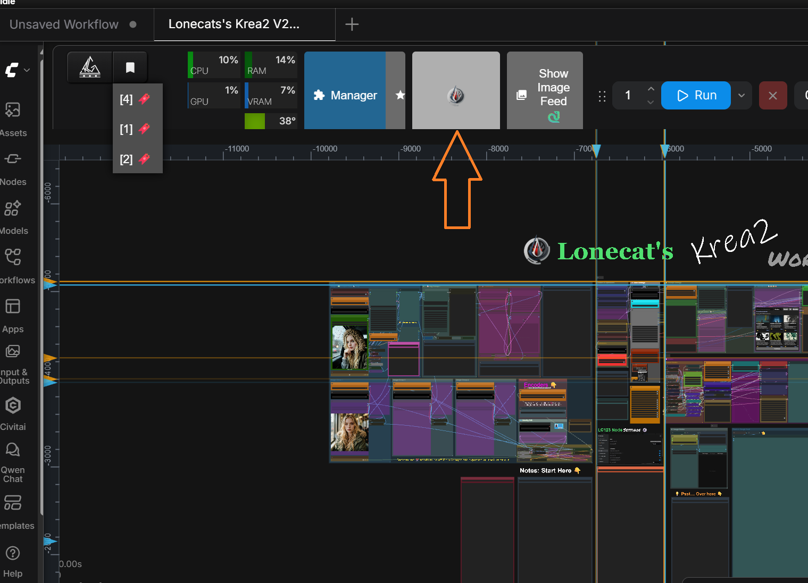
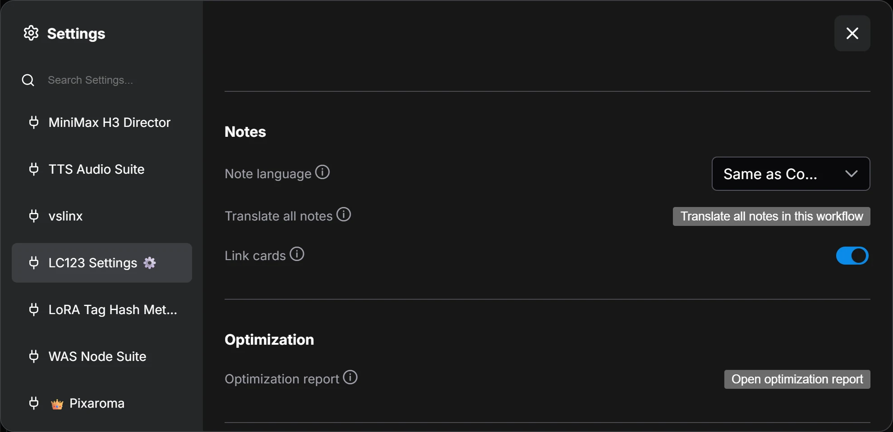
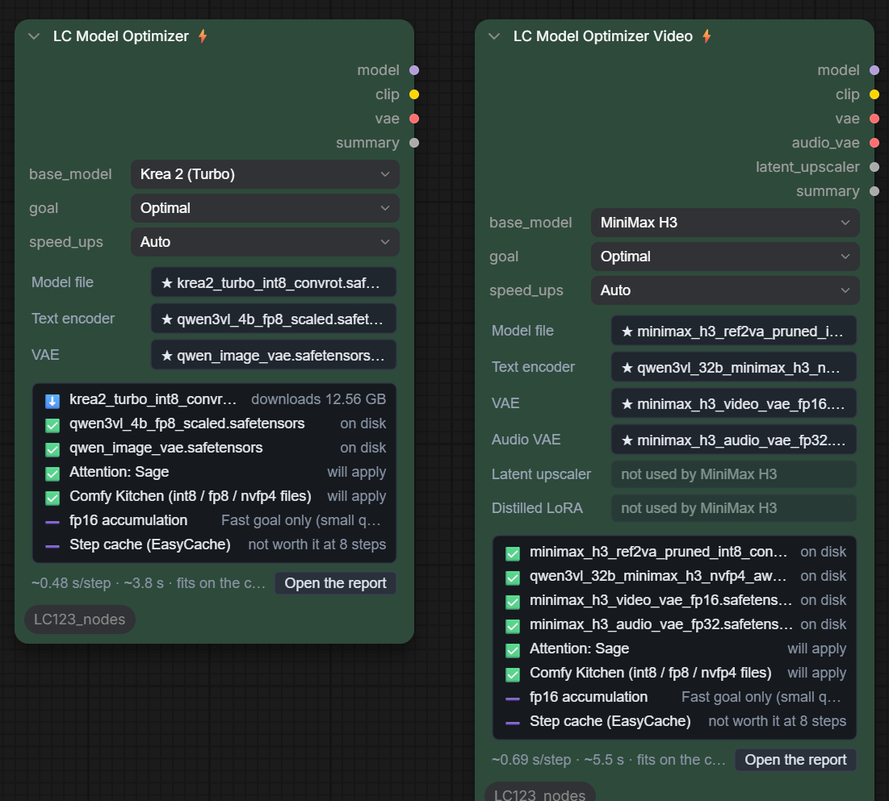
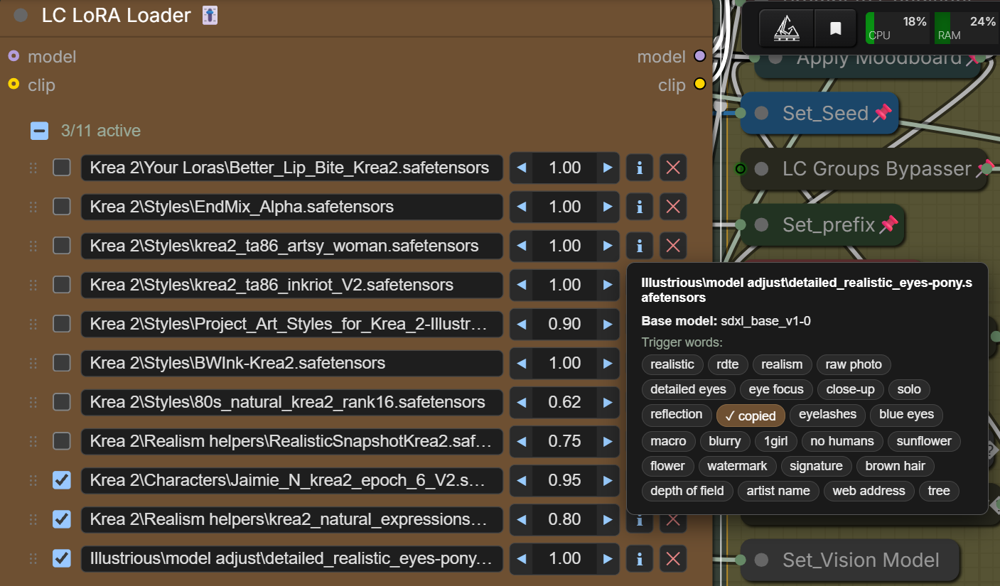
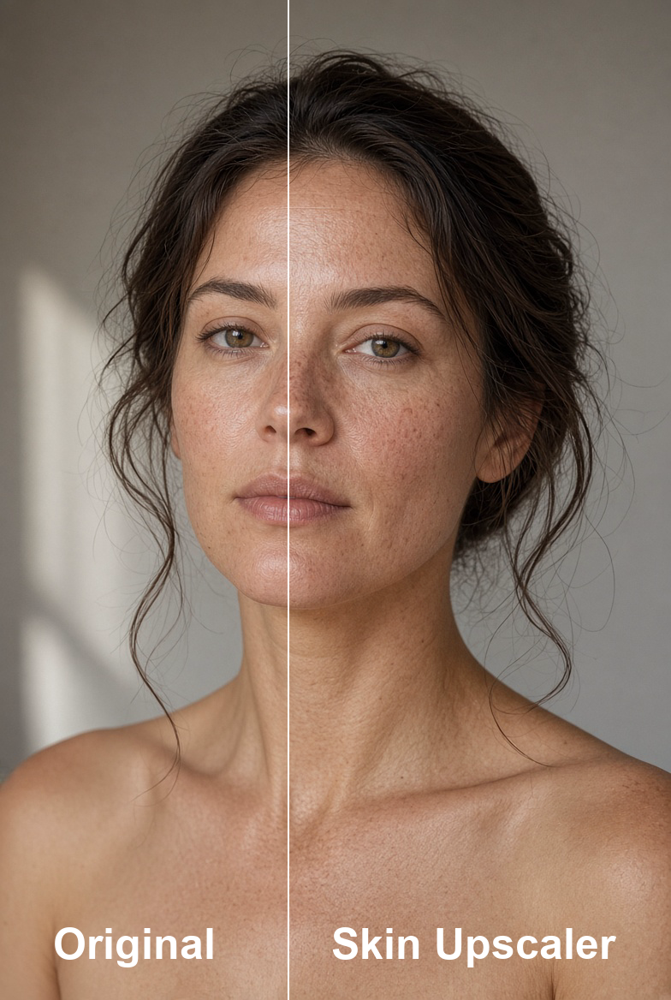
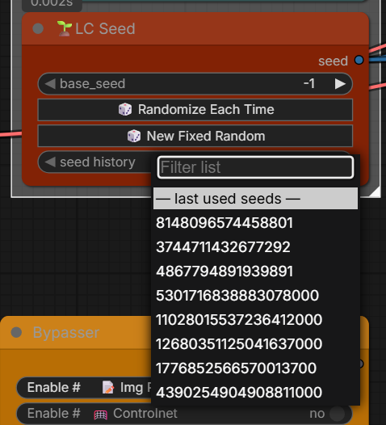

# ComfyUI LC123 Nodes

Custom nodes for [ComfyUI](https://github.com/comfyanonymous/ComfyUI) by [lonecatone23](https://github.com/lonecatone23).

- **Repo:** [github.com/lonecatone23/ComfyUI_LC123_nodes](https://github.com/lonecatone23/ComfyUI_LC123_nodes)
- **CivitAI:** [lonecatone23](https://civitai.com/user/lonecatone23)
- **Instagram:** [synth.studio.models](https://www.instagram.com/synth.studio.models/)
- **Support:** [Buy me a ☕](https://ko-fi.com/lonecatone)
- **Version:** 1.45.11 · **136 Python nodes** · **5 JS-only** (LC Bypasser, LC Mute, Groups Bypasser, Panel, LC Note)

> Small tools that remove friction: less wire mess, fewer clicks, clearer workflows.

- This page describes the pack **as it is right now**. Release history lives in the **git tags**.
- Every node and its category: [`NODES.md`](NODES.md)
- For **Anima regional attention**, also grab [Sen-sou Anima Regional Conditioning](https://github.com/Sen-sou/Comfyui-Anima-Regional-Conditioning).

**On this page**
1. [Canvas tools](#-canvas-tools) (Align, Connection FX, Comfy Optimization Report, System & Model Optimization Report, Pin all)
2. [Settings](#%EF%B8%8F-lc123-settings)
3. [Notes, labels and previews](#-notes-labels-and-previews)
4. [LC Model Optimizer](#-lc-model-optimizer-loader--speed-ups) (loads the right files and speed-ups for your machine)
5. [LoRA loaders](#%EF%B8%8F-lora-loaders)
6. [Lighting](#-lighting)
7. [Skin, sharpening, depth and looks](#-skin-sharpening-depth-and-looks)
8. [Image FX](#-image-fx-on-node-preview--wipe)
9. [Image and size](#%EF%B8%8F-image-and-size)
10. [Prompt Builder](#%EF%B8%8F-prompt-builder)
11. [Sampling, sigmas, latents and pipes](#-sampling-sigmas-latents-and-pipes)
12. [Saving, metadata and text](#-saving-metadata-and-text)
13. [Switches, logic and control](#-switches-logic-and-control)
14. [Regional canvas](#-regional-canvas)
15. [Example workflows](#-example-workflows), [Assets](#-assets), [Quick tips](#-quick-tips), [Install](#install)

---

## 🧭 Canvas tools

Tools for the canvas itself, not nodes. Nothing here touches your generations.

**Align 📐**
- Turn it on and off with the **Align** button in the top toolbar: the LC logo. Dark gray = off, light gray with the red flame = on.



- **Rulers** appear on the top and left edge:
    - **Left click** a ruler: a **Node line** (blue). Nodes snap to it.
    - **Right click** a ruler: a **Group line** (orange). Groups snap to it.
    - **LC Notes** snap to both, since a note can label a node or a group.
    - Click a line's marker again to remove it. Drag a marker to move it.
- Lines stay invisible until you get close, then fade in. They save with the workflow.
- **Snap distance is ComfyUI's own Snap to grid size** (Settings > Lite Graph > Canvas). Want it tighter? Make the grid smaller. New lines land on that grid too.
    - **Shift** while dragging hands the drag to ComfyUI's own grid snap (no line snap). With **Always snap to grid** on, a line snap still wins on the axis it caught.
- **The Align on/off is saved in the workflow.** Save it with Align on and it opens with Align on. Every workflow tab keeps its own, so switching tabs never mixes them up.
    - *note:* switching it counts as a change to the workflow, so you get the unsaved dot.
- Don't want it at all? **Settings > LC123 Settings ⚙️ > Align > Align tool** turns off the button and everything with it.

**Connection FX 🔌** (off by default)
- While you drag a wire, every socket it can plug into glows in its own socket color.
- Get close and rings pulse out of the socket. Closer = bigger and brighter.
- Zoomed out, every valid socket glows brighter so you can still find it.
- Costs nothing unless you are holding a wire.

**Comfy Optimization Report 🩺**
- Why is my canvas slow? This tells you.
- It pans your canvas by itself for about 8 seconds, times what every pack in the open workflow draws and runs, and scans their files.
- You get a list, biggest win first:
    - ⚠️ big gain · ✅ worthwhile gain · 💡 small gain · ⚪ already set · ➖ does not apply · ℹ️ required, no setting for it
- Sorted into: **that pack's own settings** (exact name, where it lives, current value), **LC123 settings**, **ComfyUI settings**, **sidebar tabs**, and **required to function**.
- **Show last run** flips to the previous report. Each new run shows what got faster and which fixes are done.
- Only node packs used in the open workflow are analyzed. Nothing is changed. (Keep the mouse still while it runs.)
- Open it from **Settings > LC123 Settings ⚙️ > Optimization**, or right-click the empty canvas.
- 💡 On a big workflow, the usual winner is links: **Link Render Mode** set to Linear instead of Spline.

**System & Model Optimization Report 🖥️**
- Will this run on my machine, and which model files should I get? This tells you.
- It tests your machine in about 10 seconds:
    - **Hardware:** graphics card, VRAM, RAM, page file, drive speed, PCIe link.
    - **Speed-ups:** Sage, Triton, Sol-Attn, Comfy Kitchen, fp8 / int8 / nvfp4, llama-cpp for LC Vision. Each one is actually run, not just looked up.
    - *note:* Sage is checked against standard attention, so a Sage that runs but makes gray noise shows up as ⚠️.
- ⚠️ problem · 💡 worth changing · ✅ works · ℹ️ info · ➖ not installed
- **Recommended to install:** when Sage, Triton, Comfy Kitchen or llama-cpp is missing (or failed its test), links to reliable builds matched to YOUR card, PyTorch and install type, plus the command. Links only: they're other people's projects, nothing is installed for you.
- **LC Vision model suggestion:** the Qwen3-VL size and quant for your card (Quality / Optimal / Fast), and the context size to set.
- **When picking a model (includes custom models):** what file type to get on YOUR machine for Quality, Optimal and Fast, a size guide, and what to avoid. Works for finetunes and merges too.
- **Model recommendations:** pick a model and a goal, get the exact files: download link, size, how close it is to bf16, time per step on your machine, and whether it fits. ✅ = you already have it.
    - **All base models at a glance** lists every model at once.
    - Models covered: MiniMax H3, Krea 2 (Turbo and Raw), LTX 2.5, LTX 2.3, Anima, Z-Image Turbo, Qwen-Image 2.1, Flux.2 Klein 9B, Ideogram 4, SDXL, Illustrious XL, Pony Diffusion V6 XL.
    - Measured on an RTX 5090 and an 8 GB RTX 5060 Laptop. Image models land within about 15 %; video models are rougher and it says so.
- **Show last run** and **Copy report** work like the Comfy Optimization Report. It will not run while ComfyUI is generating.
- Nothing is changed. Open it from **Settings > LC123 Settings ⚙️ > Optimization**, or right-click the empty canvas.
- The **[LC Model Optimizer](#-lc-model-optimizer-loader--speed-ups)** nodes use this report to load the right files and speed-ups for you.

**Pin (all) / Unpin (all) 📌**
- Right-click any node, group or the empty canvas.
- Pins or unpins everything in the graph you are looking at, nothing needs to be selected.

*note:* Align works on the classic canvas and in Nodes 2.0. Connection FX is classic only; with Nodes 2.0 turned on it stays out of the way.

**Nodes 2.0:** every LC node works, but the live on-canvas extras (hover wipe, drag-to-place, the Sigma Curve editor, the crop box) are classic only. In Nodes 2.0 you get the result as it was at the last run instead: the finished image on FX nodes, the cropped image, a picture of the sigma curve, and the Get Image / Image-Mask Resize / Boolean readouts as a line of text. Classic always comes first.

---

## ⚙️ LC123 Settings

Open **Settings** (the gear) and pick **LC123 Settings ⚙️**. These are **UI only**: smoother canvas, lighter previews. They never touch VRAM, generation or the image that comes out of a socket. (A lighter preview never means a lighter image.)


**Align**

| Setting | Default | What it does |
|--------|---------|--------|
| **Align tool** | On | The whole tool, including its logo button in the toolbar. Off = no button, no rulers, no snapping |
| **Rulers** | On | Top and left rulers while Align is on |
| **Line reveal distance (px)** | 120 | Lines stay invisible until you get this close |
| **Also snap to other nodes and groups** | Off | On = also snap to other nodes' edges and centers (no line is shown for those) |

**Connections**

| Setting | Default | What it does |
|--------|---------|--------|
| **Connection FX** | Off | Socket glow and rings while you drag a wire |
| **Connection FX reach (px)** | 160 | How close the cursor has to be before the rings start |
| **Connection FX zoomed-out glow (%)** | 60 | How much brighter valid sockets glow when zoomed out |

**Notes**

| Setting | Default | What it does |
|--------|---------|--------|
| **Note language** | Same as ComfyUI | The language every LC Note opens in (when it has that translation) |
| **Translate all notes** | button | Translates every LC Note in the open workflow into your Note language (needs LC Vision) |
| **Link cards** | On | `@[card](https://…)` lines show as link cards. Off = plain links |

**Optimization**

| Setting | Default | What it does |
|--------|---------|--------|
| **Comfy Optimization Report** | button | See [Canvas tools](#-canvas-tools) |
| **System & Model Optimization Report** | button | See [Canvas tools](#-canvas-tools) |

**Performance**

| Setting | Default | What it does |
|--------|---------|--------|
| **Remove wipe** | Off | No hover wipe on the Image FX previews |
| **Half-resolution previews** | Off | FX previews drawn at half size |
| **Clamp longest side** | Off | Shrinks preview textures to **Max edge** |
| **Max edge (px)** | 768 | Used by Clamp. Try 512 on heavy graphs |
| **No preview when collapsed** | On | Collapsed FX nodes skip their preview |
| **Hide FX on-node previews** | Off | The lightest option: no FX previews at all |
| **Preview distance (px)** | 40 | Like node text, a preview switches off when you zoom out far enough that it is drawn smaller than this. Smaller previews switch off first. 0 = always draw |
| **Skin Beauty full preview override** | On | Skin Beauty keeps a full-quality preview even with Half-res or Clamp on |
| **Recent colors** | On | Your last 8 custom colors in the right-click **Colors** menu (adds a 🎨 Custom picker if Custom Scripts is not installed) |
| **LoRA loader info button** | On | The ℹ button on each LC LoRA Loader row |

- **LC Image Compare**, **LC Image Split** and **LC Dynamic Overlay** keep their full preview and wipe no matter what (only **Preview distance** switches them off when zoomed far out).
- 💡 Laggy graph? Turn on **Half-resolution previews** and **Clamp longest side** (512). Still laggy? **Hide FX on-node previews**, then run the **Comfy Optimization Report**.

Full directions: [`LC123_Performance_Settings_Note.md`](LC123_Performance_Settings_Note.md)

---

## 📝 Notes, labels and previews

**LC Note 📝**

A markdown note that speaks your reader's language. Write it once, translate it, and the translations ship inside the workflow.

- The dropdown at the top lists ComfyUI's 14 languages, each in its own script: ✏️ original · ✅ translated · ⚠️ the original changed since it was translated · ❌ not translated.
- **The language every LC Note opens in** is set in Settings > LC123 Settings ⚙️ > Notes > **Note language**. *Same as ComfyUI* follows your ComfyUI language. A note without that translation shows its original.



- Pick a ❌ (or ⚠️) language and click **Translate now**. Nothing ever translates on its own, so edit as much as you like before you ship it.
- ⚠️ keeps showing the older translation until you re-translate, so readers never get an empty note.
- 💡 **Translating needs [LC Vision](https://github.com/lonecatone23/ComfyUI_LC_Vision_nodes) installed. Nothing to wire.** Reading and switching languages works for everyone with just LC123.
- **The title follows the language too.** A translation on screen shows `⚙️ Settings/ ⚙️ 设置`. No translated title? You get the same words twice, so you know it is not an error.
- **Renaming always changes the original title.** Translations then show ⚠️ until you re-translate.
- **✏️ follows your ComfyUI language.** A Spanish ComfyUI starts a new note as Español ✏️. Right-click the note to change which language is the original.
- The **◀ ▶ arrows** only flip between languages the note actually has. To translate a new one, open the list.
- عربي, فارسی and עברית display right to left. You can edit any translation by hand.
- **Translate all notes** (Settings > LC123 Settings ⚙️ > Notes) translates every LC Note in the open workflow, subgraphs too, into your Note language in one go. Notes already in that language or with an up-to-date translation are skipped; ⚠️ ones are redone. Only LC Notes are touched. Needs LC Vision. ⚠️ Save the workflow afterwards.
- **Link cards.** Put a link on a line of its own as `@[card](https://…)` and it shows as a card: the page's picture, site, title and description. `@[card: Download here](https://…)` adds your own caption. Click the card to open the page. Normal links stay normal links.
    - Works for GitHub, CivitAI, YouTube (videos, Shorts and channels), Instagram and most sites that share a preview.
    - ComfyUI reads each card's page once to get its title and picture, and the picture loads from that site. Only public web addresses, never your own machine or network. Turn cards off in Settings > LC123 Settings ⚙️ > Notes > **Link cards**.
- **Nodes 2.0:** a note keeps the size you give it. Long text scrolls inside (the mouse wheel scrolls it, Ctrl+wheel zooms) instead of stretching the node.

**LC Label 🏷️**

A text label for annotating a workflow, with a rotate handle like Word or Paint. No title, no sockets, no execution.

- **Rotate:** select it, drag the round handle. Snaps to 5° with a magnet at 0, 90 and 180 (**Shift** = 15°, **Alt** = free).
- **Scale:** drag a corner. **Wrap:** drag a side handle and the text reflows (**Wrap width 0** = auto).
- **Pin it** and it locks: clicks pass straight through, and only Ctrl+drag a box around it selects it again.
- **Settings:** double-click. Text, font, size, bold / italic, align, color, outline, shadow, background.
- **Never buried:** drawn as HTML above the canvas, so nodes and links can't cover it.
- **Fonts:** 14 ship with the pack (Bebas Neue, Oswald, Permanent Marker, Pacifico, Lobster, Great Vibes, Abril Fatface, Cinzel Decorative, UnifrakturMaguntia, Monoton, Bangers, Creepster, Rubik Glitch, Press Start 2P), licenses included in `web/fonts`, plus your system fonts. Each one shows in its own typeface in the dropdown.

**LC Image Label 🖼️⚙️**
- A chromeless sticker: drag an image onto the canvas (or double-click > Load Image) and it floats there. No title bar, no sockets.
- Rotate, grow (corners) or stretch (sides, Shift keeps the proportions). Double-click for width, height, angle, padding, border and background.
- Baked into the workflow as a small webp, so it survives sharing even after the original upload is gone.

**LC Preview Image 🖼️ / LC Preview Mask 🎭**

Previews that stay quiet when nothing arrives. The core previews complain when an upstream node is muted, bypassed or hands over a null. These just sit there.

- **Optional input:** nothing connected, a muted branch, a null or an empty batch is fine. No error.
- **Pass-through output:** the image / mask comes out the other side. No signal = anything after it is skipped quietly.
- They show as soon as their image is ready, not after the whole workflow finishes. Batches show the first frame.
- Preview Image launches in the LC teal. Preview Mask launches black.

---

## ⚡ LC Model Optimizer (loader + speed-ups)

The **System & Model Optimization Report** tells you what suits your machine. The **LC Model Optimizer** sets it up for you. It replaces your model, text encoder and VAE loaders: the first thing you wire in.

**LC Model Optimizer ⚡ / LC Model Optimizer (pipe) ⚡** (image models)
- Outputs: `model`, `clip`, `vae`, `summary`. The pipe version adds an `LC_PIPE` in front (model 2 = Ideogram 4's second model).
- Krea 2 (Turbo and Raw), Qwen-Image 2.1, Z-Image Turbo, Flux.2 Klein 9B, Ideogram 4, Anima, SDXL, Illustrious XL, Pony Diffusion V6 XL (the SDXL family loads as one checkpoint: text encoders and VAE come from it).

**LC Model Optimizer Video ⚡ / LC Model Optimizer Video (pipe) ⚡** (video models)
- Outputs: `model`, `clip`, `vae`, `audio_vae`, `latent_upscaler`, `summary`. The pipe version adds an `LC_PIPE` in front (vae 2 = audio VAE).
- MiniMax H3, LTX 2.5, LTX 2.3 (its distilled LoRA is applied at 0.5, like Comfy's template).
- *note:* the outputs never change with the base model. These nodes sit at the start of the graph, so your wires stay put. A part the model doesn't use just shows **not used by** (e.g. no upscaler on MiniMax H3).

**How it works**
- Pick the **base model** and a **goal** (Quality / Optimal / Fast, same as the report).
- **Every file defaults to ★ Recommended:** the file the report picked for this machine. No report yet? Comfy's own default files, and a 💡 to run the report.
- **File pickers work like the LC LoRA Loader:** click to browse your folders, with a search box. On top:
    - **★ Recommended** (and the actual file name it will use)
    - **From checkpoint** / **None**
    - **⬇ Download:** recommended files you don't have yet. They download on the first run, then the picker switches to the real file name.
    - **On disk for this model:** your files that match the base model.
    - Then all your folders, so **custom models** work too.
- **All-in-one checkpoints:** the text encoder and VAE come from the checkpoint (you can still pick your own).
- **Custom (any other model or workflow):** set the base model to **Custom** (image and video).
    - Pick your own files. ★ Recommended, downloads, estimates and file checks show as **unsupported** (we have no data for it).
    - The speed-ups still apply.
    - `clip_type` (Custom only): how the text encoder loads. **auto** works when the encoder matches one of the models above; otherwise set it (e.g. `chroma` for Chroma).
- **GGUF:** loads through **ComfyUI-GGUF**. A GGUF it refuses (e.g. a `krea2` tag) falls back to the **calcuis gguf** pack if you have it.

**Speed-ups (Auto)**
- **Attention:** Sage (or Flash) only if it passed the report's test on this machine.
- **Comfy Kitchen:** used on its own for int8 / fp8 / nvfp4 files. The node just tells you if it's working.
- **fp16 accumulation** and **Step cache (EasyCache):** Fast goal only. The step cache only when it's worth it (20+ steps).
- **Manual:** set `speed_ups` to Manual and pick each one yourself, **torch.compile** included.

**The status panel (on the node)**
- Each file: ✅ on disk · ⬇️ downloads X GB · 📦 from the checkpoint.
- Each speed-up: will apply / applied, or ➖ and why not.
- Estimated time per step on YOUR machine, whether it fits on the card, and **Run or Open Report** (shows the saved report, or runs one if there isn't one yet).
- ⚠️ **Mismatch hints:** a text encoder or VAE that doesn't belong to the base model (e.g. Qwen3 8B on Krea 2) gets a warning. It is read from the file header, nothing loads. It still lets you use it: a hint, not a block.



---

## 🎚️ LoRA loaders

**LC LoRA Loader 🎚️**

A multi-row LoRA loader modeled on rgthree's Power Lora Loader, rebuilt to fix three things: it did not render in Nodes 2.0, it re-centred on a cross-page paste, and its Info never showed anything.

- **Rows:** enable, pick the file, set a strength. Drag the ⋮⋮ handle to reorder.
- **Strength:** ◀ number ▶. Click an arrow to step 0.05, drag the number to scrub, click it to type.
- **model and clip are both optional:** leave one unconnected for a model-only or clip-only chain.
- **➕ Add LoRA / ✕ per row**, plus Select all / Deselect all / Remove all in the right-click menu.
- **Folder picker:** click a row's file to browse your folders (as deep as they go), with a search box that fuzzy-matches your whole library.
- **ℹ Info:** trigger words from the LoRA file's own metadata, no network call.
- Rows that are off, at 0, or point at a file that moved are skipped instead of failing the whole graph.
- Real HTML in one widget, so it works the same in classic and Nodes 2.0, and copy/paste never resets it.



**LC LoRA Loader Stack 🎚️ / LC Apply LoRA Stack 🎚️**
- The loader split in two (like Comfyroll's CR LoRA Stack): build the rows once, apply them to more than one model/clip pair.
- **Stack:** the same face as LC LoRA Loader, no sockets in, a `LORA_STACK` out.
- **Apply:** `model` / `clip` / `lora_stack` in, `model` / `clip` out, and a **bypass** switch.
- `LORA_STACK` is the standard community shape, so it also plugs into Comfyroll, Efficiency Nodes, Impact Pack, etc.

---

## 🔦 Lighting

**LC Lighting Control V2 🔦**

Relight an image after the fact. Feed it a **normal map** + **depth map** (and optionally a subject mask) and it repaints light and shadow on the same pixels, with real cast shadows. No re-generation.

- **Presets:** Soft window, Rembrandt, Split, Top light, Under light, Rim, Golden hour, Campfire, Cyberpunk, Key + fill, Flat front. Change any value and it flips to **custom**.
- **Light stage:** drag = XY, Shift+drag / wheel = Z. A blue arrow shows where the shadow falls.
- **Shadows:** soft, hard or off, with **shadow_blur**, **self_shadow** (head on body) and **background_shadow** (0 = distant background, 1 = wall right behind).
- **Spot or sun** per light, plus **warmth** and an optional colored gel (**color** + **color_amount**).
- **advanced** toggle for the fine controls.
- Outputs: **image** · **shadow_mask** (white = lit) · **light_layer**.

**LC Lighting Control 🔦** (the original)


| Input | Role |
|--------|------|
| **image** | Photo / render to relight |
| **normal_map** | Surface facing (BAE / DSINE recommended) |
| **depth_map** | Near vs far (Depth Anything V2 recommended; invert if lighting looks inside-out) |
| **mask** (optional) | Subject matte, used only when **mask_enabled**. High blend can fringe: ~0.2 to 0.45 or leave it off |

- **How it works:** every pixel is multiplied by how much light actually hits it. Facing the light = brighter. Turned away or blocked = darker. Ambient is the floor, so shadows don't crush to black.
- **XYZ** = aim. **+X** = from the right · **+Y** = from above · **Z** 0 to 1 (1 = front). **Size** = spot to flood. **Intensity 0** = that light is off.
- Two lights, each with its own aim and shadows. Light stage: white = light 1, red = light 2.
- Outputs: **image** (relit) · **debug_mask** (ignore it).
- Needs (not bundled): Depth Anything V2, a normal-map preprocessor, optional remBG.
- 💡 Intensity ~1.0 to 1.3, ambient ~0.25 to 0.4, shadow strength ~0.4. Grey fringe? Turn the mask off.

---

## ✨ Skin, sharpening, depth and looks

**LC Skin Beauty ✨**

Mask-aware skin cooling and brightening, done in **CIELAB**. It grades the skin, not your whole frame.


- Auto skin mask (eyes and lips protected, busy fabric suppressed).
- Feed it an **external MASK** (SAM person, say) and it intersects with the auto mask.
- Presets load the sliders. From there, **what you see is what runs**.
- On-node wipe preview. Outputs **image** + **skin_mask**.
- **device:** **auto** (default) runs it on the GPU when there is plenty of free VRAM (about 250x faster), otherwise on the CPU. **cpu** never touches VRAM. Same result either way.

| Goal | Tip |
|------|-----|
| Natural cleanup | Preset **Natural** or **Warm keep**, strength ~0.7 to 1.0 |
| Less plastic | Lower **smooth**, raise **texture_preserve** |
| Fabric leaks | Lower **mask_sensitivity**, or feed a person/skin **MASK** |
| Check targeting | Look at the **skin_mask** output first |


**LC Skin Upscale ✨**

One **UPSCALE_MODEL** + an optional **MASK**. It crops to the matte, runs the model, feathers it back in. That's it. It is not Ultimate SD Upscale wearing a disguise.



- **`detail 1x`**: pastes back at the source size. Use this for 1x SkinContrast / ITF.
- **`scale`**: keeps the model's native factor. Everything outside the mask stays bilinear.
- Optional **MASK** (PersonMaskUltra `face` + `body` is the good combo). `mask_source`: **input** / **chroma** / **input+chroma**.
- **blend** 0 = original, 1 = full patch under the matte.
- **transfer**: **detail band** (default) takes only the model's pore and fold detail, brightness only and softly capped, so no colour shift and no 1-pixel grain. **full paste** is the old behaviour. **softness** smooths the detail band.
- ⚠️ Don't load a 4x model in `detail 1x`. You pay for 4x the time and throw the extra pixels in the trash.
- 💡 Daily setup: `1xSkinContrast-High-SuperUltraCompact` · `detail 1x` · blend `0.75` · Ultra `face+body` · `mask_source: input` · tile `256` / overlap `16`.

Example: [`workflows/LC Post Processing Nodes V7.0.json`](workflows/LC%20Post%20Processing%20Nodes%20V7.0.json)

**LC Sharpen Pro 🔪**

Works on brightness only, so colors never shift, in three stages:

- **sharpen:** capture sharpening by deconvolution. It undoes softness instead of drawing outlines around everything.
- **texture:** mid-size detail like pores, fur, fabric and pencil hatching.
- **clarity:** large-scale punch on an edge-aware base, so no dark rings around your subject.
- **halo:** how far an edge may overshoot. 1 = no rims at all.
- Flat areas are left alone based on the noise in each image, so anime fills and gradients stay clean.
- **Presets:** Natural, Subtle, Portrait, Product, Landscape, Crisp, plus **Lineart**, **Anime sharp** and **Illustration**. Touch a slider and it flips to **Custom**.
- 💡 Line art, anime and illustration: keep **skin_protect** at 0 (the art presets already do).

**LC Depth FX 🌫️ + Looks 🎞️**

What a real camera does to a scene, in the order light travels. Wire a depth map from **LC Depth Anything** (LC MaskMaker) and you get what AI images are missing.

- **haze:** the far distance loses contrast toward its own color, like real air. The subject is never touched, and a dark room stays dark.
- **light_wrap:** bright background light bleeds over the subject's edges. Kills the cut-out sticker look.
- **dof_blur:** depth of field that grows with distance from focus. The subject never smears into the background.
- **auto_focus:** finds the subject and focuses on the top of it (the head). A curtain at the side gets ignored.
- **focus_mask** (optional): wire a face or person mask and focus lands exactly there.
- **bokeh:** isolated lights out of focus turn into discs. A whole city of glints stays faint.
- The depth direction is detected automatically, so no Invert node.

**LC Bloom** has a **mode**:
- **Bloom:** the classic glow. Old workflows render exactly the same.
- **Pro-Mist:** a diffusion filter in front of the lens. Soft warm glow, gentler contrast.
- **Halation:** the red-orange glow film gets around bright edges.

**Looks:** Natural, Portrait, Cinematic, Golden hour, Vintage, Dreamy, Landscape, Night, B&W.
- Pick the same look on **Depth FX, Bloom, Lens Profile, Vignette, Film Stock (Color / B&W)** and **Film Grain** and they're built to match. Click it and forget it.
- Moving any slider switches that node to **Custom**. Old workflows load as **Custom** with every value as saved.
- 💡 The B&W look drives **LC Film Stock (B&W)**. On the Color stock node it turns itself off.

**The order** (scene, lens, film):
1. LC Image Denoise / LC Skin Upscale
2. LC Skin Beauty
3. LC Sharpen Pro (before the blur, never after)
4. LC Depth FX
5. Color: LC Auto White Balance, Color / Tone Match, Lift Gamma Gain, Vibrance or LUT
6. LC Bloom (Pro-Mist)
7. LC Lens Profile (or LC Chromatic Aberration)
8. LC Bloom (Halation)
9. LC Film Stock
10. LC Film Grain, always last

- 💡 **LC Photo Style / Phone Look** replaces steps 6 to 10. Use one path or the other.

**LC Photo Style 📷** (still BETA)
- A camera/phone **finish**, not lens geometry. Presets drive the sliders, and most controls sit at **0 = no change**.
- **Strength** blends against the original so you can always pull it back.
- Presets: Standard, Natural, Dramatic, Quiet, Muted, Amateur, Cool day, Warm evening, Bright open, iPhone, **Nikon Z7 II**, **Canon R5**. Full list: [`LC_Photo_Style_Note.md`](LC_Photo_Style_Note.md)

---

## 🎨 Image FX (on-node preview + wipe)

Hover any of these to wipe against the original. Heavy graph? See **Performance** in [Settings](#%EF%B8%8F-lc123-settings).

| Node | What it does |
|------|----------------|
| **LC Image Adjust** | Brightness, contrast, saturation, hue |
| **LC Auto White Balance** | Auto WB, no fuss |
| **LC Sharpen Pro** | See above |
| **LC Lens Profile** | Lens-style FX. (**LC Lens FX (deprecated)** is hidden from search but still runs in old workflows) |
| **LC Lift Gamma Gain** | Color-wheel style lift / gamma / gain |
| **LC Image RGB** | Per-channel RGB control |
| **LC Film Grain** | Grain. A little goes a long way |
| **LC Film Stock (B&W)** / **(Color)** | Stock film looks, real blacks on B&W. Bright colours roll off and keep their hue instead of clipping |
| **LC Vibrance** | Smart saturation that won't blow out skin. Works on colour strength only, so hues never shift |
| **LC Vignette** | Edge darkening |
| **LC Bloom** | Glow, Pro-Mist or Halation |
| **LC Depth FX 🌫️** | Haze, light wrap and depth of field from a depth map |
| **LC Chromatic Aberration** | RGB fringe |
| **LC Image Denoise** | **smart** (default) measures the noise in each image, cleans brightness grain and colour speckle separately, and brings back pores and hair where they stand above the noise. **noise_report** says how noisy each image was. **legacy** is the old edge-gated blur. 💡 On heavy noise, add LC Film Grain after it so skin does not look plastic |
| **LC Color Match 🎨** | Matches a reference with **skin_protect**. **oklab** (default) matches how all the colours relate, not each channel on its own; **oklab + distribution** also matches the shape of the colours (best for copying a grade, can over-match a different scene); **adain** / **mean_std** are the old methods. oklab methods use every reference frame and run on the GPU. Optional **mask**: white = match, black = keep |
| **LC Tone Match** | **image** supplies the detail, **reference** supplies lighting / color. Optional **mask** (white = lock). **split**: **guided** (default) follows the image's own edges, so no bright or dark rim on hard edges; **blur** is the old split. Wipes against the reference |
| **LC Image Desaturate** | Desaturate, plain and simple |
| **LC Skin Beauty ✨** / **LC Skin Upscale** / **LC Photo Style 📷** | See above |
| **LC Skin Texture ✨** | Adds real pore texture to skin that came out too smooth (after a strong denoise, a beauty pass or a plastic-looking model). Takes only the fine relief of a real skin photo, never its colour, and adds less where skin already has detail. **mask**: LC Person Mask (mediapipe, face + body, remove_features) is ideal; unwired, skin is found by colour. **reference**: your own skin close-up, or the bundled CC0 photo |
| **LC Apply LUT** | Reads `.cube` files from **`ComfyUI/models/luts/`**. Launches with **LC_Crushed_Blacks** at 0.3. Sample LUTs copy over from `assets/luts/` and never overwrite yours. **interpolation**: **tetrahedral** (default, GPU, cleaner greys) or the old **trilinear** |
| **LC Text Overlay** | Text on an image: align, drag or type the position. Shrinks to fit if the font would run off the edge. Includes the 14 bundled fonts |
| **LC Phone Filters 📱** | The 37 phone-app presets (1977, Aden, Brooklyn, Xpro2, etc.). Pick one, dial strength, wipe to compare |
| **LC Directional Blur** | Motion blur along one angle/length. Drag the arrow on the node, or double-click a readout to type. **strength** blends back toward the original. **taps** = smoothness, **edge** = what it reads past the border |

---

## 🖼️ Image and size

| Node | What it does |
|------|----------------|
| **📐 Aspect Ratio Simplifier** | **aspect_ratio_source** = image/mask: keeps the image's aspect ratio and scales it up or down so the longer side is **max_resolution** (0 = keep its size). Or a preset / custom size. Resizes image and mask together. Crop / stretch / pad / total pixels. Outputs an empty latent too. Default upscale is **lanczos** |
| **📐 Aspect Ratio Simplifier (pipe)** | Same node plus a pipe out |
| **LC Aspect Ratio Pipe (In/Edit)** | Packs image, mask, width, height, latent, batch, resolution into a pipe, or edits one. Only the sockets you wire overwrite |
| **LC Aspect Ratio Pipe Out** | Unpacks the aspect pipe. 💡 This used to be called Pipe (In/Edit), old workflows still load it |
| **LC Get Image 📐** | Megapixels, width, height, batch, aspect, longer side |
| **LC Dimension Resize 📐** | One value in, add / sub / mul / div both sides, rounded outputs |
| **LC Image-Mask Resize 📐** | Image + mask only. **match_aspect_ratio**, **upscale_by** none / multiplier / megapixels. The real **WxH** is drawn on the node after a run |
| **LC Image to Total Megapixels 📐** | Scales to a total megapixel count, plus **resolution** and **megapixels** outputs. 1 MP = 1,000,000 pixels, the same count LC Get Image uses (the native node counts 1024 x 1024) |
| **LC Batch Image 🖼️** | Autogrow IMAGE slots into one batch. Muted or empty sockets are skipped. Mixed sizes follow the first live image |
| **LC Image Batch From Folder 📂** | A whole folder as one batch (img2 before img10). Full path or a folder in `ComfyUI/input`, pasted however you like. **max_images** (0 = all) and **start_index** to load in chunks. Outputs the batch, counts and file names |
| **LC Image Compare 🔎** | Batch A/B with one slider per pair |
| **LC Image Split 🖼️** | Saveable A\|B wipe. The output is the baked split |
| **LC Image Grid 🖼️** | Contact sheet: columns, gap, pad, outline |
| **LC Last Image Holder** | Holds the last image so you can clear it without a re-run |
| **LC Dynamic Overlay** | Overlays B on A. Outputs the blended image |
| **LC Image Pass** / **LC Mask Pass** | Identity pass. `enable` off (widget or a wired BOOLEAN) blocks the output, so optional sockets downstream see nothing |
| **LC Watermark 💧** | Image watermark with size, opacity and drag-to-place. Transparent PNG: wire Load Image's MASK to **watermark_mask** |

---

## 🗒️ Prompt Builder

A modular stack that funnels into **🧩LC Prompt Assembler**.

```
Subjects + Scene + Camera + Lighting + Style + Palette
        → 🧩LC Prompt Assembler
              → prompt  → CLIP / conditioning
              → json    → Krea2 / Ideogram builder
```

| Node | Role |
|------|------|
| 🗒️LC Subject / Subject Array | Character + placement (bbox trailers for JSON) |
| 🗒️LC Scene / Camera / Lighting / Style | Environment and look |
| 🎨LC Color Palette | Preset or sampled from an image |
| 🎲LC Wildcard | A random line from `assets/wildcards/` |
| 🧩LC Prompt Assembler | `include_scene_bboxes` is off by default: subject boxes only |

- 💡 `prompt` goes to CLIP. `json` is for the regional builders only. Don't cross the streams.

Full directions: [`LC_Prompt_Builder_Note.md`](LC_Prompt_Builder_Note.md)

---

## 🧪 Sampling, sigmas, latents and pipes

| Node | What it does |
|------|----------------|
| **LC Sampler Configure** | Dual-pass control in one place: steps, swap point, detailer, denoise, CFG 1/2, sampler, scheduler |
| **LC Sampler Configure (pipe)** | Same, with pipe in / out |
| **LC Sampler Configure Simple** (+ pipe) | Single CFG, no step swap |
| **LC Sampler Configure Pipe Out** | Unpacks an LC_PIPE into sampler sockets, plus **latent** |
| **LC Split Sigma Scheduler** | Splits one noise schedule across two models |
| **LC Split Sigmas (Advanced)** | Two sigma curves + two models + denoise. Falls back to model 1 if model 2 is missing |
| **LC Basic Scheduler** | Scheduler + steps = sigmas. No denoise |
| **LC Sigma Curve** | No MODEL needed. Named schedules (`simple`, `karras`, `beta57`, `bong_tangent`, `linear_quadratic`, `kl_optimal`, etc.), your saved curves, and **Custom**. Drag a knot and it becomes Custom. **Save curve** arms the save, you still queue it. Your saves live in `ComfyUI/user/LC123/sigma_curves/`, so an update never touches them (older saves in the pack still load) |
| **LC Sigma Resample** | Same sigma path, new **real** step count: `new_steps = round(old x multiplier) + adder`. Put it **after** a split, on the slice you want denser |
| **LC Sigmas (BETA)** | One scheduler for one- and two-pass sampling. **preset** fills in the sampler + shape that tested best for your model (Krea 2, Z-Image, Flux 2, SDXL / Illustrious), or **auto** reads the loaded model. **focus** (structure ↔ detail), **shift**, image-to-image **denoise** (the info line shows the real starting noise), a **handoff** split whose low pass always starts where the high pass stopped (also with a second **model_2**), and **renoise** for ControlNet cleanup. Outputs both sigmas, the noise for each pass and the sampler. Live graph on the node |
| **LC Detail Daemon (BETA)** / **(model)** | Adds fine detail by hiding a little of the noise from the model. **amount** is a plain % (not multiplied by CFG), **start / end** are how far along the image is, so they land the same at any step count. **mode auto** fixes the classic method working backwards on Krea 2. Sampler version for SamplerCustomAdvanced, model version for a plain KSampler |
| **LC Reference Latent** | Up to 8 optional reference latents into conditioning. All empty = pass-through |
| **LC Denoise 💉** | Latent injection: `noise_std = 1 - denoise`. Match the sampler's denoise |
| **LC Pipe (in/edit)** / **Pipe Out** / **Detail Pipe Out** | Bundle or unpack models, clips, VAEs, prompts, seed, steps, the works |
| **LC Pipe Combine** | Edits the top pipe with a second pipe: whatever the edit pipe carries overwrites the top one, everything else rides along |
| **LC MiniMax H3 Pipe** / **Pipe Out** | H3 refs on one pipe: fl2va / ref2va model + clip, VAEs, size, length, frame rate, ref images and videos |
| **LC MiniMax H3 Pipe V2** | Everything above plus `prompt`, `total_steps`, `cfg`, `sampler_name`, `scheduler`. Feed a V1 pipe in to upgrade it |
| **LC Image Ref Pipe In** / **Out** | Up to 16 reference images on one wire. Sockets grow as you fill them, same as Text Encode Qwen Image 2.1 |
| **Prompt to Conditioning** / **+ Zero** | A string into conditioning |
| **LC Positive / LC Negative** | Pre-colored prompt boxes |

- 💡 **H3 prompt tags are 1-based:** `<Picture 1>` = `ref_image_0`. Native MiniMax **Ref2V** needs `ref_video` to be at least **5 frames**.
- 💡 Aspect Ratio Simplifier's pipe into the H3 **pipe** socket only copies the size. Length and fps still need their own wires.

---

## 📁 Saving, metadata and text

| Node | What it does |
|------|----------------|
| **LC Easy Folder 📂** | A combined prefix for Save Image, or wire it into LC Save Image's `filename_prefix` |
| **LC Advanced Folder 📂** | Filename and path split apart |
| **LC Save Metadata 🏷️** | Optional **LC_PIPE in**. Fills prompts, seed, steps, CFG, sampler, scheduler, size and denoise. Widgets win when set (seed `-1`, steps/cfg `0` = use the pipe). **civitai_air** takes an AIR tag or a CivitAI URL |
| **LC Save Image 💾** | `filename` + `path` under the output folder. PNG gets the workflow, `parameters`, `civitaiResources` and AutoV2 hashes. JPEG/WebP only get a short comment (a format limit, not a bug). Muted, bypassed and switched-off LoRAs are skipped |
| **📝 LC Save Text** | Writes text to a file, cleaning illegal path characters |
| **LC Join Strings 🔗** | Joins N strings. Empty slots skip the delimiter. `\n` allowed |
| **LC Show Text 🔤** | Text on the node |
| **LC Show Any 🔤** | Wire in anything, it shows on the node and the **same value** comes out. Images, masks and latents show their size |
| **LC Text Replace ✂️** / **LC Text Remove 🔪** | Up to 20 pairs, the node grows as you add them |
| **CivitAI 🚩🔪** | Removes the words in `assets/lists/civitai_compliance_remove.txt` from a prompt (whole words only), like the "child" / "late teens" wording LLMs sometimes (and abliterated models especially) add to adults. **Off when you place it:** switching it on is your choice. Workflows saved before the switch keep stripping. ⚠️ A word filter, not a safety system: it guarantees nothing, and what you post is on you. Read [`assets/lists/README_civitai_compliance.txt`](assets/lists/README_civitai_compliance.txt) |

- 💡 **Name tokens:** type **%model %seed %steps %cfg %sampler %scheduler %denoise %width %height** anywhere in Easy Folder, Advanced Folder or LC Save Image, e.g. `Krea2/%model/Test_%seed`. LC Save Image fills them from the **LC Save Metadata** pipe. Missing value? The token drops out and the leftover `_` is tidied up. ComfyUI's `%date:yyyy-MM-dd%` still works too.
- 💡 **Hash files:** leave them on so CivitAI can list your resources (it matches by AutoV2 hash, not file name). The first hash per model is slow, then a `.sha256` sidecar makes it instant.

Details: [`LC123_Save_Image_Note.md`](LC123_Save_Image_Note.md)

---

## 🔀 Switches, logic and control

| Node | What it does |
|------|----------------|
| **LC AnySwitch** | First connected input wins. The type locks in from whatever wired first |
| **LC Any Index Switch** | Index widget plus dynamic `any_*` slots. Output length matches the selected slot only |
| **LC Custom Combo** | `inputcount` sets the options: STRING + INDEX + OPT_CONNECTION out |
| **LC Custom Combo Panel** | A compact remote for a combo hub elsewhere in the graph |
| **LC Combo Selector** | A dropdown that mirrors another node's combo |
| **LC Boolean** / **Invert Boolean** | Coerce to true/false. Both carry a hidden `boolean` widget so Bypasser / Mute read a live signal without a queue |
| **LC Is Bypassed / Muted** | True if the node wired into `value` is bypassed or muted. Only which node the wire comes from matters |
| **LC Widget To String** | The KJ WidgetToString pattern. Unwired + id 0 + empty title = **dormant** (returns `""`), that is on purpose |
| **LC Boolean Switch** / **Flip** / **Value** | Pick or emit booleans |
| **LC Int Compare** / **LC Float Compare** | Largest or smallest of two values |
| **LC Any Empty Bool / Int / Float** | Autogrow `any_*`. True / `empty` if any plugged source is empty, muted or bypassed. Only plugged sockets count |
| **LC Int Split** | `total` splits into `a` + `b`. `split_point` is a fraction (0 to 1), not a count |
| **LC Seed Jump 🌱** | One seed + a jump = six stepped seeds |
| **🌱LC Seed** | Type a number for a fixed seed, or **Randomize Each Time** / **New Fixed Random**. A **seed history** remembers the last 10 seeds this node actually ran with. Capped at 2^53-1, the browser's safe integer limit |
| **LC Slider** | A plain slider that looks the same in classic and Nodes 2.0. Double-click the value to type. min / max / step / decimals behind the faint gear |
| **LC Node Snapshot 📋** | Reads another node's widgets: value / dump / JSON. With **source** wired it shows the values the node actually ran with, so a seed or slider plugged into a widget shows its real value. |
| **LC Notify 🔊** | Plays a sound from `assets/sounds/` when the run reaches it. always / on empty queue / never |
| **LC Bypasser** / **LC Mute** / **Groups Bypasser** / **Bypasser Panel** | Remote **bypass** (pass-through) or **mute** (never runs). Panel's `hub` accepts any of the three |
| **LC Bypass Relay** | Autogrow `*` targets on the left. Its `OPT_CONNECTION` goes into a Bypasser or Mute, and every target follows the hub. The state survives a refresh |
| **LC Stop 🛑** | Pauses the graph until you press the button |
| **LC VRAM Cache Clear** | Clears VRAM / cache, then passes through |



- 💡 **Bypass vs mute:** Bypasser passes through (mode 4). Mute never runs (mode 2).
- Manual node sizes and colors you set yourself stick across a reload. Pack colors only apply on the first drop.

---

## 🎨 Regional canvas

| Node | What it does |
|------|----------------|
| **LC Anima Regional Inline Canvas** | RGB paint for Sen-sou Anima regional conditioning |
| **LC Krea2 Regional Inline Canvas** | Same idea for Krea2 CLIP regions (**beta**) |

---

## 📂 Example workflows

| File | Description |
|------|-------------|
| [`workflows/LC Node examples.json`](workflows/LC%20Node%20examples.json) | A tour of the utility, image, prompt and sigma curve nodes |
| [`workflows/LC Skin Beauty.json`](workflows/LC%20Skin%20Beauty.json) | Skin Beauty with an optional mask |
| [`workflows/LC Skin Beauty basic (no deps).json`](workflows/LC%20Skin%20Beauty%20basic%20(no%20deps).json) | Skin Beauty on its own |
| [`workflows/LC Dual sigma workflow example.json`](workflows/LC%20Dual%20sigma%20workflow%20example.json) | Split sigma |
| [`workflows/LC Dual Sigma Advanced workflow example.json`](workflows/LC%20Dual%20Sigma%20Advanced%20workflow%20example.json) | Advanced split sigmas |
| [`workflows/LC Better Sigmas V1.0.json`](workflows/LC%20Better%20Sigmas%20V1.0.json) | LC Sigmas + LC Detail Daemon against a plain euler / simple baseline, with I2I and LC Vision prompt assist |
| [`workflows/Anima Regional Conditioning WF.json`](workflows/Anima%20Regional%20Conditioning%20WF.json) | Anima regional |
| [`workflows/Anima Inline Regional Canvas workflow.json`](workflows/Anima%20Inline%20Regional%20Canvas%20workflow.json) | Anima inline canvas |
| [`workflows/Anima Inline Regional Canvas example.json`](workflows/Anima%20Inline%20Regional%20Canvas%20example.json) | Anima inline canvas, example |
| [`workflows/Krea2 Inline Regional Canvas Example.json`](workflows/Krea2%20Inline%20Regional%20Canvas%20Example.json) | Krea2 inline canvas |
| [`workflows/LC Post Processing Nodes V7.0.json`](workflows/LC%20Post%20Processing%20Nodes%20V7.0.json) | The full Image FX suite |
| [`workflows/LC Lighting Control (BETA).json`](workflows/LC%20Lighting%20Control%20%28BETA%29.json) | The original Lighting Control (V1) with overlays |
| [`workflows/Lonecat's Photo style Node.json`](workflows/Lonecat%27s%20Photo%20style%20Node.json) | Photo style |
| [`workflows/Photo style test.json`](workflows/Photo%20style%20test.json) | Photo style test sheet |
| [`workflows/Photo style test edit.json`](workflows/Photo%20style%20test%20edit.json) | Photo style test sheet, edit version |

Workflow > Open, or just drag it onto the canvas.

---

## 📦 Assets

| Path | Use |
|------|-----|
| `assets/readme/` | README screenshots |
| `assets/sounds/` | LC Notify (drop your own audio in, restart once) |
| `assets/lists/` | CivitAI compliance list, etc. |
| `assets/luts/` | Sample LUTs, copied to `models/luts/` on first load if missing |
| `assets/wildcards/` | LC Wildcard |
| `assets/prompt_builder/` | Prompt Builder presets |
| `assets/skin_texture/` | LC Skin Texture's CC0 skin photo (credits in its README) |
| `web/fonts/` | The 14 bundled fonts (with their licenses) |

---

## 💡 Quick tips

- **Skin Beauty:** check the **skin_mask** output first. Fabric leaking in? Lower the sensitivity.
- **Image Split:** set the wipe, queue, and save the **split** output, not the two source images.
- **Reference Latent:** all slots empty = pass-through. Bypasser-safe.
- **Tone Match:** same crop only. Doing a head-swap? Mask the new head black. It is not a Color Match substitute.
- **Color Match mask:** white = regrade, black = keep. Leave it unconnected for the old behavior.
- **Save Image:** needs `path` + `filename`. The metadata node is optional. JPEG/WebP won't carry the full Comfy JSON.
- **Index Switch:** output length is whatever the selected slot is. Other wired lists don't get zipped to match.
- **Sigma Curve:** saves to `ComfyUI/user/LC123/sigma_curves/`, safe from updates. Stretch the node to grow the plot. Save curve doesn't queue for you.
- **Sigma Resample:** after the split, on the high band, the low band or both. It changes the real step count on that band only.
- **Batch Image:** autogrows. Muted / empty slots are skipped, and the node height follows the slots in use.
- **Bypass Relay:** wire A/B/C into the Relay's left side (`any_1` grows), Relay's OPT into a Bypasser or Mute. Hub off = all of them off together.
- **Image / Mask Pass:** `enable` off mutes only that one tap.

---

## Install

1. **Get the files.** Clone into `ComfyUI/custom_nodes/`:
   ```bash
   git clone https://github.com/lonecatone23/ComfyUI_LC123_nodes.git
   ```
   Or grab the zip from the repo page and unzip it there.
2. **Check the folder.** `__init__.py` has to sit **directly** in `ComfyUI/custom_nodes/ComfyUI_LC123_nodes/`, not one level deeper. If the zip unpacked with an extra folder, move the inner files up.
3. 💡 **No `requirements.txt`.** LC123 only needs what ComfyUI already ships with (`torch`, `numpy`), so there is no pip step.
4. **Restart ComfyUI.** The console prints an `[LC123] +` line per module as it loads. Nothing? The folder structure is off, go back to step 2.
5. **Missing nodes in an example workflow?** ComfyUI Manager > Install Missing Custom Nodes (Depth Anything, SAM, remBG, etc. are separate installs).
6. 💡 After any update, restart and press **Ctrl+F5** so the browser loads the new files.

---

## License

MIT. See `LICENSE`.

Borrowed code, with thanks (all MIT): colour science in `vendor/chromagrade` from ComfyUI-ChromaGrade (MONKEYFOREVER2), guided filter and tetrahedral LUT adapted from the same; band-pass detail transfer and skin texture synthesis adapted from ComfyUI-SkinDetailer; Photo Style local tone mapping re-written after ComfyUI-CameraForensicRealism.

This represents hundreds of hours of work. If you enjoy it, please 👍 like, 💬 comment, and feel free to ⚡ tip 😉

"True Nothing is. Permitted Everything is"- Yoda Auditore, Assassin's Wars
